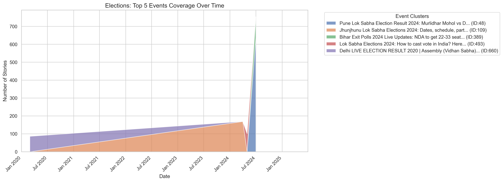
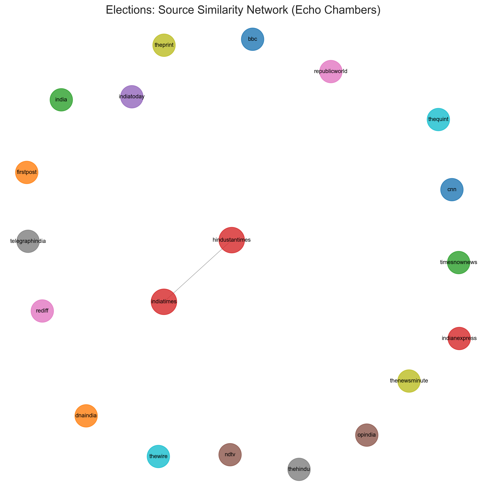
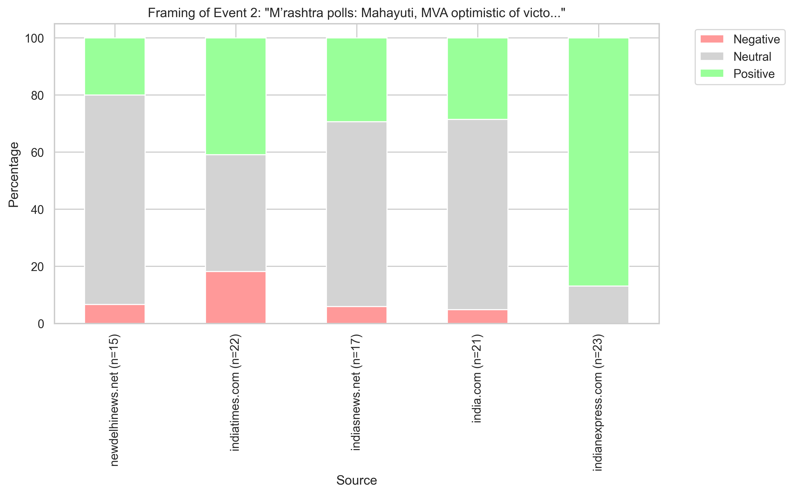
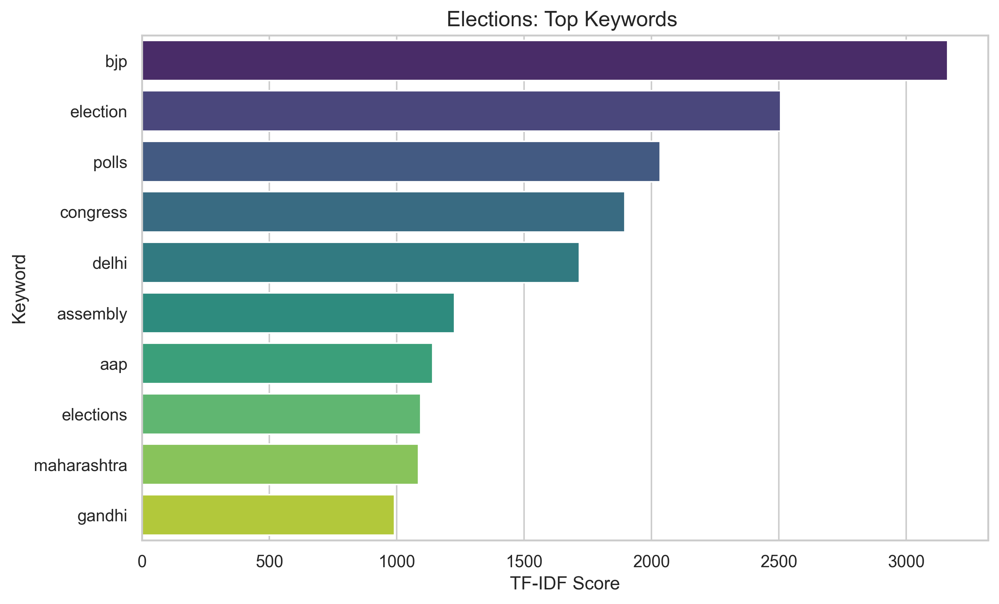

# Media Bias Analysis: Event Framing & Agenda Setting

## Project Overview

This project analyzes media bias in Indian news coverage using data from MediaCloud. By leveraging advanced Natural Language Processing (NLP) and Network Analysis techniques, we move beyond simple volume metrics to understand **Agenda Setting** (what is covered) and **Framing** (how it is covered).

## Technical Methodology

### 1. Data Collection

We fetch news stories dynamically from the **MediaCloud API**, ensuring a comprehensive dataset of Indian media coverage.

- **Source**: MediaCloud API.
- **Collections**:
  - **India National**: Collection ID `34412118`
  - **India State/Local**: Collection ID `38379954`
- **Topics**: Defined in `config.py` (e.g., Elections, Budget, Military).
- **Volume**: Configurable limit (default 20,000 stories per topic) to ensure statistical significance.
- **Deduplication**: Stories are deduplicated by ID to prevent redundancy when sources appear in multiple collections.

### 2. Clustering: Event Threading with Time Decay

To analyze "Events" rather than just keywords, we group stories using an **Event Threading** approach inspired by _Nallapati et al. (2004)_. This method allows us to track the evolution of a single event over time.

- **Semantic Embedding**:
  - We use **Sentence Transformers (SBERT)** (`all-MiniLM-L6-v2`) to generate high-quality 384-dimensional vectors for each headline.
- **Time Decay Distance Metric**:
  - Standard clustering often splits a long-running event (e.g., a multi-day election count) into separate clusters. We solve this by introducing a **Time Decay** factor.
  - **Formula**:
    $$ Similarity*{combined} = Similarity*{content} \times e^{-\alpha \cdot \Delta t} $$
    Where:
    - $Similarity_{content} = 1 - CosineDistance$
    - $\Delta t$ = Time difference in days between two stories.
    - $\alpha$ = Decay rate (set to `0.15`).
  - **Effect**: Stories published on the same day must only be semantically similar to cluster together. Stories published 5 days apart must be _nearly identical_ to cluster together.
- **Algorithm**:
  - **Agglomerative Clustering** is applied to this custom distance matrix with a threshold of `0.5`.

---

## Visualizations & Analysis

We use the "Elections" topic as a case study to demonstrate our analysis pipeline.

### 1. Coverage Bias (Agenda Setting)

**Insight**: Tracks which events dominated the news cycle.

- **Metric**: Volume of stories per Event Cluster over time.
- **Visualization**: Stacked Area Chart.



### 2. Network Analysis (Echo Chambers)

**Insight**: Identifies "Echo Chambers" where sources report on the same specific events.

- **Nodes**: Top 20 media sources.
- **Edges**: Weighted by **Jaccard Similarity** of the story clusters they cover.
- **Interpretation**: Thick edges = High overlap in agenda.



### 3. Statement Bias (Sentiment Analysis)

**Insight**: Gauges the overall tone of coverage.

- **Tool**: **VADER** Sentiment Analysis.
- **Metric**: Ratio of Positive vs. Negative headlines.


### 4. Event Framing

**Insight**: Reveals how different sources "frame" the _same_ event.

- **Method**: Compares sentiment distributions for the top 5 sources within a single Event Cluster.
- **Visual**: Stacked bar charts with a pastel palette.


_(Example: Framing of a specific election event)_

### 5. Keyword Analysis

**Insight**: Highlights the dominant vocabulary.

- **Method**: TF-IDF extraction.



---

## Project Structure

- `main.py`: The primary entry point. Runs the full pipeline.
- `config.py`: Configuration for API keys, collection IDs, date ranges, and search queries.
- `modules/`:
  - `data_loader.py`: Fetches stories from MediaCloud.
  - `clustering.py`: Implements Event Threading with Time Decay.
  - `analysis.py`: Performs sentiment, keyword, and network analysis.
  - `visualization.py`: Generates and saves plots.
- `output/`: Contains generated reports, JSON exports, and visualization images.

## How to Run

1.  **Install Dependencies**:
    ```bash
    pip install -r requirements.txt
    ```
2.  **Set API Key**:
    - Create a `.env` file: `MC_API_KEY=your_api_key_here`.
3.  **Run the Pipeline**:
    ```bash
    python main.py
    ```
    - Results will be saved in the `output/` directory.
